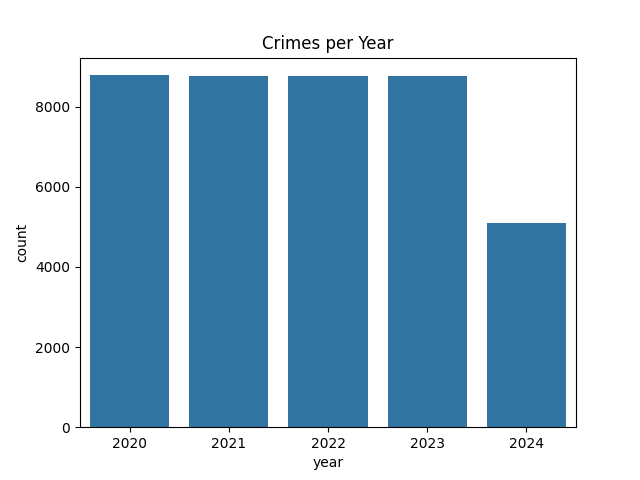
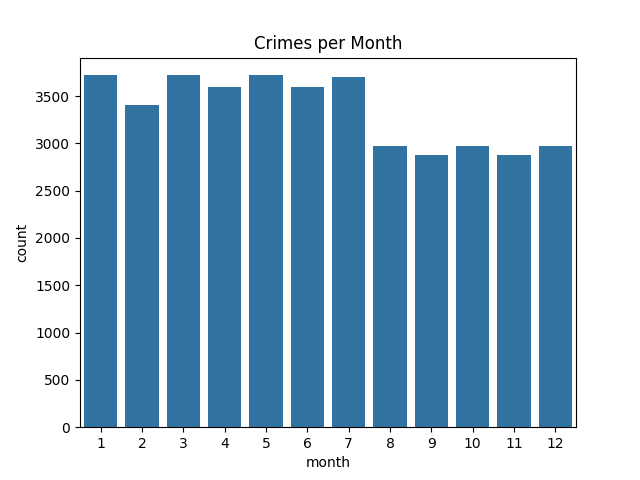
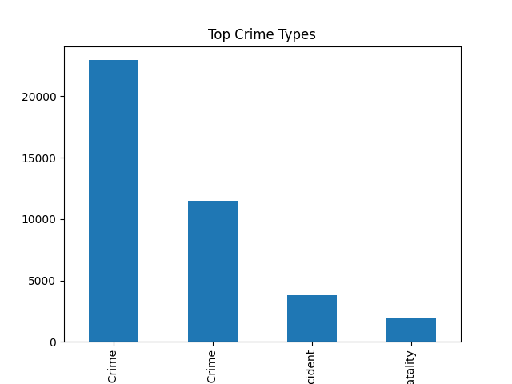
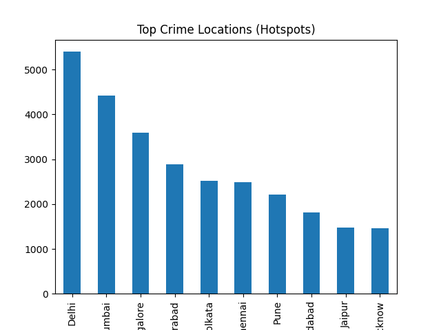
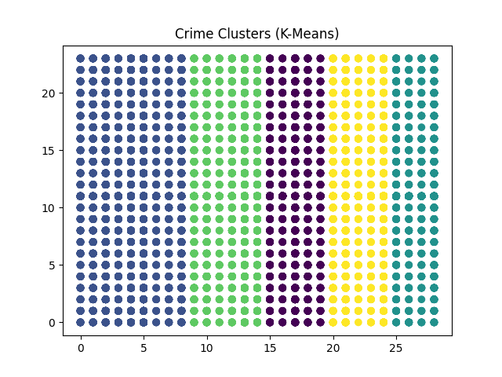
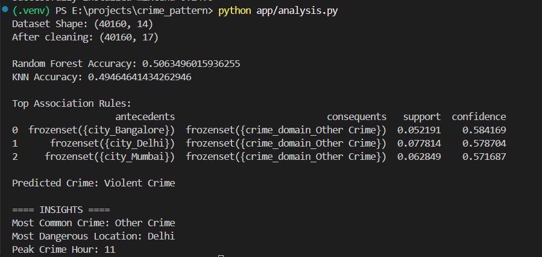

# 🔍 Crime Pattern Analysis

## 📌 Overview
This project analyzes large-scale crime data using machine learning and data mining techniques to identify patterns, trends, and high-risk areas.

The system processes **40,000+ crime records** and provides insights such as crime hotspots, peak crime times, and predictive analysis of crime categories.

---

## 🚀 Features
- 📊 Crime trend visualization (year-wise & month-wise)
- 📍 Hotspot detection using K-Means clustering
- 🤖 Crime prediction using Random Forest & KNN
- 🔗 Pattern discovery using Apriori algorithm
- 🧠 Insight generation (crime type, location, time)

---

## 🛠️ Technologies Used
- Python
- Pandas, NumPy
- Scikit-learn
- Matplotlib, Seaborn
- Mlxtend (Apriori)

---

## 📂 Project Structure
crime_pattern/
│── app/
│ └── analysis.py
│── images/
│── requirements.txt
│── README.md
│── .gitignore

---

## 📊 Dataset
- Contains **40K+ crime records**
- Features include:
  - Date of occurrence
  - Time of occurrence
  - City (location)
  - Crime type (domain)

⚠️ *Dataset not included in repository due to size.*

---

## ▶️ How to Run

### 1. Install dependencies
pip install -r requirements.txt

### 2. Run the project
python app/analysis.py

---

## 📈 Results

- 🔹 Model Accuracy:
  - Random Forest: ~50–57%
  - KNN: ~48–50%

- 🔹 Key Insights:
  - Most common crime: **Other Crime**
  - Hotspot location: **Delhi**
  - Peak crime time: **Around 11 AM**

- 🔹 Association Rules:
  - Cities like Delhi, Mumbai show higher occurrence of general crime categories

---

## 🧠 Machine Learning Techniques Used

### 🔹 K-Means Clustering
Used to identify crime hotspots by grouping similar locations.

### 🔹 Random Forest
Used for classification of crime types based on time and location features.

### 🔹 K-Nearest Neighbors (KNN)
Used as an alternative model for comparison.

### 🔹 Apriori Algorithm
Used to discover association rules between location and crime types.

---

## ⚠️ Challenges
- Class imbalance (dominance of "Other Crime")
- Inconsistent or missing time data
- Moderate prediction accuracy due to real-world data noise

---

## 🚀 Future Improvements
- Handle class imbalance using SMOTE or resampling
- Add more features (victim age, weapon type)
- Improve model accuracy
- Add interactive dashboard or map visualization

---

## 🎯 Conclusion
This project demonstrates how machine learning and data mining techniques can be used to analyze crime patterns and generate actionable insights.

---

## 📸 Output Screenshots

### 📊 Crimes Per Year

### 📅 Crimes Per Month

### 🚨 Top Crime Types

### 📍 Crime Hotspots

### 🔵 K-Means Clustering

### 🖥️ Model Output

